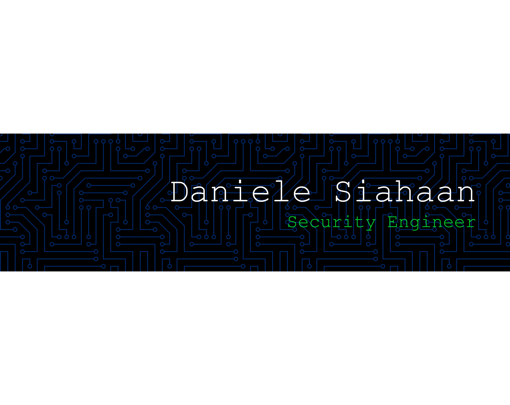

## Hi there 👋

<!--
**DanieleSiahaan29/DanieleSiahaan29** is a ✨ _special_ ✨ repository because its `README.md` (this file) appears on your GitHub profile.

Here are some ideas to get you started:

- 🔭 I’m currently working on ...
- 🌱 I’m currently learning ...
- 👯 I’m looking to collaborate on ...
- 🤔 I’m looking for help with ...
- 💬 Ask me about ...
- 📫 How to reach me: ...
- 😄 Pronouns: ...
- ⚡ Fun fact: ...
-->

# Daniele Siahaan 👋

I am a dedicated **Information Technology student** at **Universitas Sumatera Utara (USU)**. My passion lies at the intersection of system defense and digital forensics. I am currently honing my skills to become a professional **Security Engineer** who can build resilient and secure digital environments.

### 🎯 Focus & Education
* **Areas of Interest:** Cybersecurity, Network Security, and Ethical Hacking.
* **Academic Background:** Information Technology, Universitas Sumatera Utara.
* **Currently Learning:** Advanced Linux Administration and Web Vulnerability Assessment.

---

### 🛠️ Tech Stack & Tools

---

### 🛡️ Cyber Security Platforms

---

> *“Security is not a product, but a process.”*